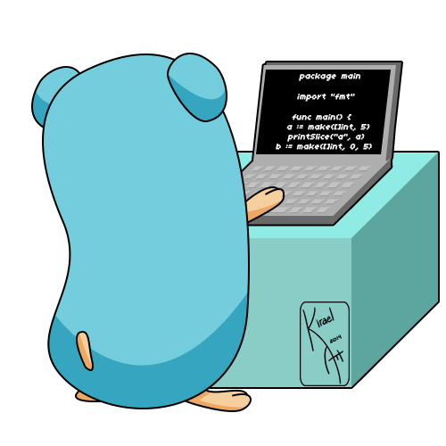

<!--- Olá, esse é meu readme, fique à vontade para utilizá-lo como quiser! -->

-----

-----

 <i><b>Olá</b> :wave:, sou a <code>Ana Carolina Muniz</code>, tenho 21 anos e moro em Belo Horizonte - MG. Sou apaixonada por tecnologia e desenvolvimento de software, atuando na área de TI desde minha formação técnica. Atualmente sou <code>acadêmica</code> de Análise e Desenvolvimento de Sistemas no <a href="https://newtonpaiva.br/" target="_blank">Centro Universitário Newton Paiva</a> e técnica em Manutenção e Suporte em Informática pelo <a href="https://www.sistemafiep.org.br/cursos-tecnicos/cursos/curso-tecnico-em-manutencao-e-suporte-de-informatica-18-33358-368294.shtml" target="_blank">Senai Horto</a>. Possuo experiência com suporte técnico, na <a href="https://assprom.org.br/" target="_blank">Assprom</a>, com automação de processos, lógica de programação, Microsoft Office 365, metodologias ágeis e desenvolvimento de soluções voltadas para otimização de atividades. Estou sempre em busca de novos conhecimentos e desafios que contribuam para meu crescimento profissional na área de Tecnologia da Informação.</i> :woman_teacher: 

  
   
  <h3>Codando</h3>

-----

-----

-----

  

  ## 👩‍💻 Sobre Mim

 🛠️ **Técnica em Manutenção e Suporte em Informática** (2020–2023) — Formação técnica pelo <a href="https://www.sistemafiep.org.br/cursos-tecnicos/cursos/curso-tecnico-em-manutencao-e-suporte-de-informatica-18-33358-368294.shtml" target="_blank">Senai Horto</a>, com foco em manutenção de computadores, suporte técnico, redes e infraestrutura de TI.
- 🎓 **Tecnóloga em Análise e Desenvolvimento de Sistemas** — início em 02/2024 e conclusão prevista para 07/2026, pelo <a href="https://newtonpaiva.br/" target="_blank">Centro Universitário Newton Paiva</a>, com ênfase em desenvolvimento de software, banco de dados e engenharia de software.
- 💼 **Experiência em Tecnologia da Informação** — Atuação em suporte técnico, Microsoft 365, automação de processos, elaboração de planilhas, gestão de informações e resolução de problemas.
- 🗣️ **Curso de Conversação em Inglês** — <a href="https://goupschool.org/" target="_blank">Go Up School</a> (01/2023 a 07/2023), com foco em comunicação e desenvolvimento da fluência no idioma.
- 🤖 **Certificação de Introdução à Robótica com Arduino** — <a href="https://www.ifmg.edu.br/betim" target="_blank">IFMG Betim</a>, abordando fundamentos de eletrônica, programação e automação.
- 🚀 **Objetivo Profissional** — Busco oportunidades para aplicar meus conhecimentos em tecnologia, desenvolvimento de sistemas e inovação, contribuindo para soluções eficientes e para meu crescimento contínuo na área de TI.

-----

### 💜 Meus interesses pessoais

- :woman_teacher: &nbsp; Na <a href="https://newtonpaiva.br/" target="_blank">Newton Paiva</a>, sou <code>aluna</code> de Análise e Desenvolvimento de Sistemas. No futuro tenho planos de seguir para Sistemas de Informação e Cibersegurança. 
- :mortar_board: &nbsp; No <a href="https://www.senai.portaldaindustria.com.br/" target="_blank">Senai Horto</a>, fui <code>aluna do técnico</code> em Manutenção e Suporte em Informática. 
- :memo: &nbsp; Artigos em breve... ainda em construção. 
- :books: &nbsp; Acesse os livros que já li ou estou lendo no meu <a href="https://www.skoob.com.br/perfil/cahmuniz" target="_blank">Skoob</a>. 
- :soccer: &nbsp; Sou cristã, vivo em <a href="https://www.bible.com/pt" target="_blank">Jesus</a>. :rooster: 
- :video_game: &nbsp; Meus hobbies são <a href="https://store.steampowered.com/?l=portuguese" target="_bla">Steam</a>, <a href="https://www.demolidores.com.br/" target="_blank">Tibia</a>, <a href="https://olympico.com.br/esportes/basquete/" target="_blank">Jogos online </a>, violino e música clásica. 
- :speech_balloon: &nbsp; Pergunte-me sobre qualquer coisa, adoro ajudar pessoas. 
- :mailbox: &nbsp; Para me encontrar, esse é meu <a href="mailto:anamunizcarolina@gmail.com" target="_blank">e-mail</a> pessoal.

-----

### 🧰 Linguagens e ferramentas

-----

### 📊 Estatísticas do GitHub

-----

 

 

 

-----

### 📬 Vamos conversar?

-----

<table align="center">
<tr>
 <td align="center" colspan="2"></td>
</tr>
<tr>
<td>
| Créditos: <a href="https://github.com/CahMuniz" target="_blank">© 2026 Cah Muniz</a> 
| Última atualização: 24/06/2026
</td>
</tr>
<tr>
 <td align="center" colspan="2"></td>
</tr>
</table>

<!--

Olá, esse é meu readme, fique à vontade para utilizá-lo como quiser!

-----

<table>
<tr>
 <td align="center" colspan="11"></td>
</tr> 
<tr>
<td>
</td>
<td>
</td>
<td>
</td>
<td>
</td>
<td>
</td>
<td>
</td>
<td>
</td>
<!--<td>
</td>
<td>
</td>
<td>
</td>
<td>
</td>
<td>
</td>
</tr>
<tr>
 <td align="center" colspan="11"></td>
</tr> 
</table>

<i><b>Olá</b> :wave:, sou o <code>CahMuniz</code>, tenho 19 anos, moro em BH e sou programador desde os 18 anos de idade. Atualmente sou <code>Acadêmica</code> Análise e Desenvolvimento de Sistemas <a href="https://newtonpaiva.br/" target="_blank">Centro Universitário Newton Paiva</a> e Técnica em Manutençao e Suporte em Infomatica <a href="https://www.sistemafiep.org.br/cursos-tecnicos/cursos/curso-tecnico-em-manutencao-e-suporte-de-informatica-18-33358-368294.shtml" target="_blank">Senai Horto</a>.</i> :man_teacher: 

-----
 Sobre mim: 

Esperiência - Manutenção e Suporte em Informatica (2020-2023) em <a href="https://www.sistemafiep.org.br/cursos-tecnicos/cursos/curso-tecnico-em-manutencao-e-suporte-de-informatica-18-33358-368294.shtml" target="_blank">Curso técnico em Manuençã e Supote</a> pelo <a href="https://www.fiemg.com.br/senai/" target="_blank">Instituição Senai</a>,">Técnologo Análise e Desenvolvimento de Sistemas início (02/2024) previsão de término (07/2026)</a>. Curso Conversação Inglês, Go UP School (01/2023) á (07/2023). <a href="https://goupschool.org/"target= "_blank" E realizei a certificação de introdução Robótica em Arduino na <href="https://www.ifmg.edu.br/betim" target="_blank"

Meus interesses pessoais:

 
- :man_teacher: &nbsp; Na <a href="https://newtonpaiva.br/" target="_blank">Newton Paiva</a>, sou <code>aluna</code> de Análise e Desenvolvimento de Sistemas,  Futuramente tenho planos de fazer Sistema de Informação e Ciber-segurança. 
- :mortar_board: &nbsp; No <a https://www.senai.portaldaindustria.com.br/" target="_blank">Senai Horto</a>, fui <code>Aluna de Técnico </code> no curso de  Manutenção e Suporte em Informática. 
- :memo: &nbsp; Artigos em breve ... Em construção <a href="https://scholar.google.com.br/citations?view_op=list_works&hl=pt-BR&user=RQUKVMwAAAAJ" target="_blank">aqui</a>. 
- :books: &nbsp; Acesse os livros que já li ou estou lendo <a https://www.skoob.com.br/livro/lista/" target="_blank">aqui</a>. 
- :soccer: &nbsp; Sou atleticano, torço para o <a href="https://www.arenamrv.com.br/" target="_blank">galão</a>. :rooster: 
- :basketball: &nbsp; Meus hobbies são <a href="https://muonline.webzen.com/pt" target="_blank">Mu online</a>, <a href="https://www.demolidores.com.br/" target="_blank">Tibia</a>, <a href="https://olympico.com.br/esportes/basquete/" target="_blank">basquete</a>, violão e guitarra. 
- :speech_balloon: &nbsp; Pergunte-me sobre qualquer coisa, adoro ajudar pessoas. 
- :mailbox: &nbsp; Para me encontrar, esse é meu <a href="mailto:joaopauloaramuni@gmail.com" target="_blank">e-mail</a> pessoal. 
- :calendar: &nbsp; Essa é minha <a href="https://calendly.com/aramuni/30min" target="_blank">agenda</a> se quiser marcar um horário para falarmos. 
- :page_facing_up: &nbsp; Veja meu <a href="http://lattes.cnpq.br/1208427665892059" target="_blank">Currículo Lattes</a> para mais informações.

-----

&nbsp;Linguagens e ferramentas:

<code></code>
&nbsp; 
<code></code>
&nbsp; 
<code></code>
&nbsp; 
<code></code>
&nbsp; 
<code></code>
&nbsp; 
<code></code>
&nbsp; 
<code></code>
&nbsp; 
<code></code>
&nbsp;
<code></code>
&nbsp;
<code></code>
&nbsp;
<code></code>
&nbsp;
<code></code>
&nbsp;
<code></code>
&nbsp; 
<code></code>
&nbsp; 
<code></code>
&nbsp; 
<code></code>
&nbsp; 
<code></code>
&nbsp; 
<code></code>
&nbsp; 
<code></code>
&nbsp; 
<code></code>
&nbsp; 
<code></code>
&nbsp; 
<code></code>
&nbsp;
<code></code>
&nbsp;
<code></code>
&nbsp;
<code></code>
&nbsp;
<code></code>
&nbsp; 
<code></code>
&nbsp; 
<code></code>
&nbsp; 
<code></code>
&nbsp; 
<code></code>
&nbsp; 
<code></code>
&nbsp; 
<code></code>
&nbsp; 
<code></code>
&nbsp; 
<code></code>
&nbsp; 
<code></code>
&nbsp; 
<code></code>
&nbsp;
<code></code>
&nbsp;
<code></code>
&nbsp;
<code></code>
&nbsp; 
<code></code>
&nbsp; 
<code></code>
&nbsp; 
<code></code>
&nbsp; 
<code></code>
&nbsp;
<code></code>
&nbsp;
<code></code>
&nbsp;
<code></code>

GitHub Stats:

<!--- 

 Aramuni's Spotify Data

 

 &nbsp; &nbsp; 

:headphones: :guitar: :drum:

[Charlie Brown Jr. - Céu Azul Ao Vivo - Chegou Quem Faltava](https://github.com/joaopauloaramuni/joaopauloaramuni/assets/58268075/c6568311-54c8-4c00-aced-26aacd69f8a1)

-----

<table align="right">
<tr>
 <td align="center" colspan="1"></td>
</tr> 
<tr>
<td></td>
</tr>
<tr>
 <td align="center" colspan="1"></td>
</tr> 
</table>

 

 

 

-----

<table align="right">
<tr>
 <td align="center" colspan="1">Pix</td>
</tr> 
<tr>
<td></td>
</tr>
</table>

 

 

 

-----

 LinkedIn Recommendations

<table>
<tr>
 <td align="center" colspan="1"></td>
</tr> 
 <!-------
<tr>
<td>

</td>
</tr>
<tr>
<td>

</td>
</tr>
<tr>
<td>

</td>
</tr>
<tr>
<td>

</td>
</tr>
<tr>
<td>

</td>
</tr>
<tr>
<td>

</td>
</tr>
 
<tr>
 <td align="center" colspan="1"></td>
</tr> 
</table>

<table>
<tr>
 <td align="center" colspan="2"></td>
</tr> 

<tr>
<td>

</td>
<td>

</td>
</tr>
 
<tr>
 <td align="center" colspan="2"></td>
</tr> 
</table>

<table align="center">
<tr>
 <td align="center" colspan="2"></td>
</tr> 
<tr>

<td>
| Créditos: <a href="https://github.com/joaopauloaramuni" target="_blank">© 2024 Cah Muniz</a> 
| Última atualização: 29/09/2024
</td>
</tr>
<tr>
 <td align="center" colspan="2"></td>
</tr> 
</table>

*/
AAAAAAAAAAAAAAAAAAAAAAAAAAAAAAAAAAAAAAAAAAAAAAAAAAAAAAAAAAAAAAAAAAAAAAAAAAAAAAAAAAAAAAAAAAAAAAAAAAAAAAAAAAAAAAAAAAAAAAAAAAAAAAAAAAA
-->

